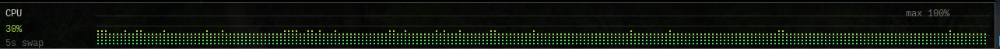
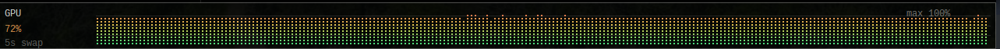
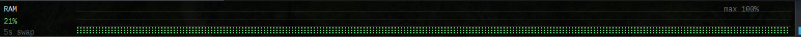
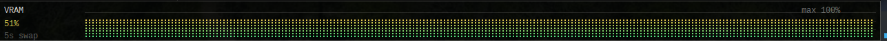
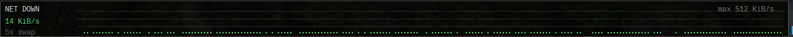
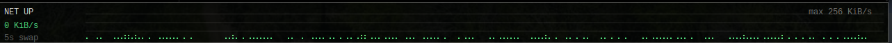

# thinmon

A small X11 desktop monitor bar for Linux. It sits along the bottom of a secondary screen and rotates through compact dot-style graphs for system stats.

## Features

- Thin always-on-top monitor strip
- Dot-style graphs instead of large line charts
- Rotates between graphs every few seconds
- Height-based coloring, from low usage to high usage
- Designed for KDE/X11
- Tracks CPU, RAM, GPU, VRAM, network download, and network upload

## Screenshots

### CPU



### GPU



### RAM



## CPU-GPU-RAM


### VRAM



### Network Down



### Network Up



## Right Click Menu


## Project layout

```text
thinmon/
├── images/
│   ├── CPU-GPU-RAM.png
│   ├── CPU.png
│   ├── GPU.png
│   ├── NetDown.png
│   ├── NetUp.png
│   ├── RAM.png
│   └── VRAM.png
├── install-user.sh
├── main.cpp
├── CMakeLists.txt
└── README.md
```

## Build

```bash
mkdir -p build
cd build
cmake ..
make
```

## Install for current user

```Bash
chmod +x install-user.sh
./install-user.sh
```

## Run

If installed:

```Bash
thinmon
```

Or from teh build folder:

```Bash
./thinmon
```

## Notes

This is built for Linux desktops running X11.  It was made for KDE/X11 setup and may need changes for Wayland
GPU and VRAM readings depend on the available system interfaces and driver support.
